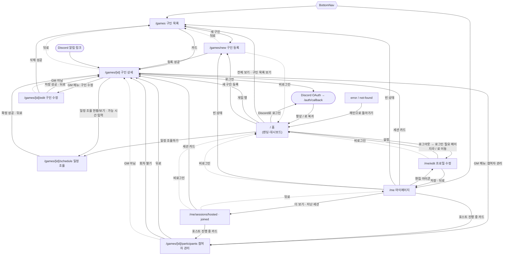

# 롤앤콜 Page Spec (apps/web)

Re-Design 전에 **현재 코드 기준**으로 정리한 페이지 스펙이다. 디자인 제안은 담지 않았다. 코드에서 확인하지 못한 항목은 `❓ 확인 필요`로 표시했다.

- 기준 시점: 2026-09-14, `main` 브랜치(`097e713`) + 미커밋 변경(join-game 버튼 분리 `JoinGameButton`/`LeaveGameButton`, `games.discord_thread_id` 컬럼)
- 공통 레이아웃·전역 컴포넌트·디자인 토큰: [_shared-layout.md](./_shared-layout.md)
- 제거·병합 후보: [deprecation-candidates.md](./deprecation-candidates.md)
- 페이지 문서는 모두 같은 10개 섹션(개요 → 접근 조건 → 진입/이탈 → 데이터 → UI 구성 → 상태별 화면 → 폼 → 액션 → 반응형·접근성 → UX 문제점) 순서를 따른다.

## 용어

| 용어            | 뜻 (코드상 이름)                                                                                                          |
| --------------- | ------------------------------------------------------------------------------------------------------------------------- |
| 구인글          | `games` 한 행                                                                                                             |
| GM(호스트)      | `games.gm_id` 사용자. 세션 목록에서는 `role="host"`                                                                       |
| 참여자 / 대기자 | `participants.status` = `confirmed` / `waiting`                                                                           |
| 모집 상태       | `deriveGameStatus` 결과. 상태값 `confirmed`의 라벨이 "대기 모집"이라 `games.confirmed_at`(확정 세션 일시)과 이름이 겹친다 |
| 일정 방식       | `schedule_mode` = `fixed`(일시 고정) / `coordinate`(일정 조율)                                                            |
| 회차            | `games.parent_game_id`로 이어지는 2회차 이후 구인글                                                                       |

## 페이지 목록

접근 권한 표기: **공개** = 비로그인도 열람 가능, **로그인** = 비로그인 시 `redirect("/")`, **GM** = GM이 아니면 `redirect("/games/{id}")`.

| 라우트                     | 페이지명             | 접근 권한                             | 목적                                                                      | 문서                                             |
| -------------------------- | -------------------- | ------------------------------------- | ------------------------------------------------------------------------- | ------------------------------------------------ |
| `/`                        | 홈 (랜딩 / 대시보드) | 공개 (로그인 여부에 따라 화면이 바뀜) | 비로그인: 서비스 소개·Discord 로그인·모집 미리보기 / 로그인: 내 게임 요약 | [home.md](./home.md)                             |
| `/games`                   | 구인 목록            | 공개                                  | 모집 중(정원 찬 구인글 포함) 구인글 검색·정렬·페이지 이동                 | [games.md](./games.md)                           |
| `/games/new`               | 구인 등록            | 로그인                                | 2단계 위저드로 구인글 작성                                                | [games-new.md](./games-new.md)                   |
| `/games/[id]`              | 구인 상세            | 공개 (액션 영역이 권한별로 다름)      | 구인글 정보 확인, 참여·대기 신청/취소, GM 메뉴                            | [game-detail.md](./game-detail.md)               |
| `/games/[id]/edit`         | 구인 수정            | GM                                    | 구인글 수정·삭제                                                          | [games-edit.md](./games-edit.md)                 |
| `/games/[id]/participants` | 참여자 관리          | GM                                    | 참여자·대기자 승격/강등/내보내기, 다음 회차 열기                          | [games-participants.md](./games-participants.md) |
| `/games/[id]/schedule`     | 일정 조율            | 공개 (입력은 GM·참여자, 확정은 GM)    | 가능 시간 입력, 히트맵 확인, 세션 일시 확정                               | [games-schedule.md](./games-schedule.md)         |
| `/me`                      | 마이페이지           | 로그인                                | 프로필·다가오는 세션 요약                                                 | [me.md](./me.md)                                 |
| `/me/edit`                 | 프로필 수정          | 로그인                                | 표시 이름·한 줄 소개·기본 가능 시간대·아바타 갱신, 로그아웃               | [me-edit.md](./me-edit.md)                       |
| `/me/sessions/hosted`      | 내가 연 세션         | 로그인                                | 호스트한 세션을 탭(`?tab=`)으로 나눠 목록 표시                            | [me-sessions.md](./me-sessions.md)               |
| `/me/sessions/joined`      | 참여한 세션          | 로그인                                | 참여한 세션을 탭(`?tab=`)으로 나눠 목록 표시                              | [me-sessions.md](./me-sessions.md)               |

화면이 없는 라우트와 전역 경계:

| 경로                          | 역할                                                                                                          | 참고                                            |
| ----------------------------- | ------------------------------------------------------------------------------------------------------------- | ----------------------------------------------- |
| `/auth/callback`              | Discord OAuth 코드 교환 후 `next`(기본 `/`)로 이동, 실패 시 `/?auth_error=1`                                  | `src/app/auth/callback/route.ts:3`              |
| `/api/cron/session-reminders` | 1시간 내 시작하는 확정 세션에 Discord 리마인더 발송 (`CRON_SECRET` 필요)                                      | `src/app/api/cron/session-reminders/route.ts:8` |
| `error.tsx` / `not-found.tsx` | 전역 에러·404 화면 (`ErrorScreen`)                                                                            | [_shared-layout.md](./_shared-layout.md)        |
| `loading.tsx`                 | `/games`, `/games/[id]`에만 있음. `/games/new`·`/edit`·`/participants`·`/schedule`은 상위 skeleton을 물려받음 | 각 페이지 문서 6장                              |

라우트 가드는 뷰 컴포넌트 안에서 처리한다. `src/proxy.ts`는 세션 쿠키 갱신만 한다.

## 페이지 간 이동 흐름

실선은 사용자 조작, 점선은 뒤로가기·권한 리다이렉트다. 세부 조건은 각 문서 3장에 있다.
