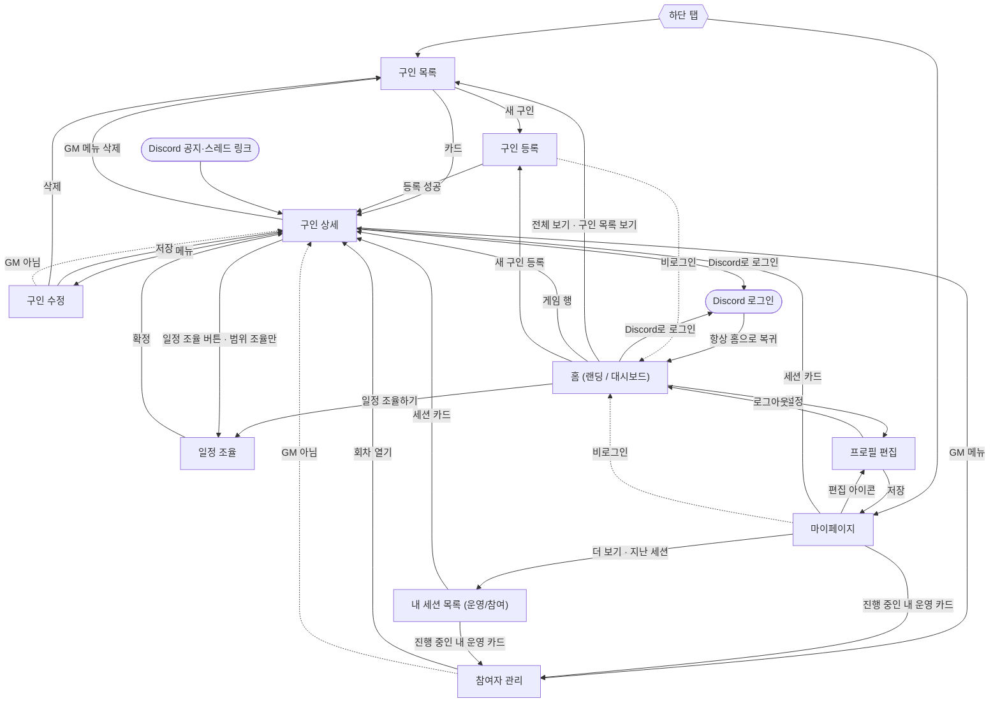

# 롤앤콜 리디자인 브리프

> 현재 화면 기준 사실만 담았다(제안 없음). 따옴표 안은 화면 문구 원문, `{ }`는 데이터 자리.
> ~~취소선~~ = 이미 해결된 문제(참고용, 현재 문제 아님).

---

## 1. 서비스 소개

**롤앤콜**은 TRPG 세션 모집부터 일정 확정까지 처리하는 모바일 웹앱이다. GM이 구인글을 올리면 플레이어가 참여하거나 대기를 신청한다. 범위 조율 글은 참여자들이 가능 시간을 격자에 칠하고 GM이 겹치는 시간으로 확정한다. 로그인은 Discord만 쓰며, 공지와 신청 소식이 Discord 서버에도 올라간다(§4).
메타 설명: "TRPG 세션, 모집부터 일정 확정까지 한 곳에서"

---

## 2. 사용자와 권한

| 사용자            | 할 수 있는 일                                                                                                                     |
| ----------------- | --------------------------------------------------------------------------------------------------------------------------------- |
| 비로그인          | 랜딩, 구인 목록·상세, 일정 겹침 보기                                                                                              |
| 로그인            | + 참여/대기 신청, 구인 등록, 마이페이지, 프로필 편집                                                                              |
| GM(작성자)        | 수정·삭제, 참여자 관리(승격·강등·내보내기·다음 회차), 가능 시간 입력, 세션 확정, Discord 세션 채널 열기/종료. 자기 글엔 신청 불가 |
| 참여자(정원 안)   | 가능 시간 입력, 참여 취소(조건부)                                                                                                 |
| 대기자(정원 초과) | 순번 확인, 가능 시간 입력, 대기 취소                                                                                              |

- 로그인 필요 화면(등록, 마이페이지, 프로필 편집, 내 세션)에 비로그인으로 오면 **안내 없이 홈으로** 간다.
- GM 전용 화면(수정, 참여자 관리)에 다른 사람이 오면 **안내 없이 상세로** 간다.
- 로그인하면 **항상 홈으로** 온다. 로그인에 실패해도 안내가 없다.

---

## 3. 핵심 용어

| 용어            | 표기                                                                                                   |
| --------------- | ------------------------------------------------------------------------------------------------------ |
| 모집 상태 배지  | "모집 중"(보라, 기한 안·정원 여유) / "대기 모집"(초록, 기한 안·정원 참) / "모집 마감"(회색, 기한 지남) |
| 일정 방식       | "범위 조율"(가능 시간을 모아 GM 확정) / "일시 지정"(등록 때 일시 입력)                                 |
| 세션 확정(잠김) | 초록 박스 "세션 확정" + 일시. 신청·취소·명단 조정이 막힌다                                             |
| 모집 마감 기한  | "모집 마감일", "마감 D-{n}"                                                                            |
| 회차            | 대기자로 다시 연 글, "{n}회차"(2회차부터)                                                              |
| 가능 시간       | 30분 단위, "내 가능 시간", "전체 겹침"                                                                 |
| GM              | 앱 전체에서 "GM {이름}"                                                                                |

**잠기는 시점**

- 범위 조율: GM이 확정하는 순간.
- 일시 지정: 세션 시각이 지났을 때. 등록 때부터 일시가 있어도 **모집 마감 기한까지 신청·대기·취소·명단 조정을 똑같이 받는다.**

**"마감"의 두 뜻**

- 기한 경과: "모집 마감", "모집이 마감되었습니다", "마감 D-n".
- 정원 충족에도 쓴다: "모집이 마감되어 취소는 GM에게 문의하세요", "마감된 게임은 취소할 수 없습니다."
- 참여자 관리 "마감되면 아래 확정 목록이 그대로 확정됩니다."는 기한을 뜻하지만 실제로 잠기지 않는다.
- "대기 모집"(정원 참)과 "세션 확정"(일시 정해짐)도 헷갈린다.

표기: "8월 16일 (일) 20:00"(한국 시간, 24시간제), "8/17", "D-3"(당일 "D-0").

---

## 4. 전역 레이아웃

- **프레임**: 320–412px 단일 컬럼, 더 넓으면 가운데 정렬 + 회색 캔버스. 시트·다이얼로그·토스트는 브라우저 기준.
- **앱바**: 화면별 52px sticky 반투명(‹, 제목, 액션). 뒤로가 있으면 제목 16px bold 말줄임, 없으면 18px. 홈엔 없음. **뒤로 목적지는 진입 경로와 무관하게 고정.**
- **하단 탭**: "구인 목록" / "마이페이지"(58px).
  - **모든 화면에 보인다**(위저드, 상세 액션 바, 랜딩 포함).
  - 홈 탭이 없어 홈에서는 둘 다 비활성.
  - 구인 하위 화면은 전부 "구인 목록" 활성.
  - 비로그인이 "마이페이지"를 누르면 홈으로 간다.
- **토스트**: 하단 탭 위 가운데, 2.5초. 성공은 기본과 같은 어두운 배경(아이콘 없음), 에러는 빨강.
- **시트**: 둥근 위 모서리, 그랩바(드래그로 안 닫힘), 행 52px.
- **확인 다이얼로그**: "취소"(outline) + 확인(위험하면 빨강). 처리 중엔 확인만 비활성, 로딩 표시 없음, 취소는 계속 가능.
- **아바타 툴팁**: hover·포커스 시 이름, "+N"은 가려진 이름들. **터치로는 안 열린다.**
- **에러**: 일러스트, "문제가 발생했습니다" / "잠시 후 다시 시도해 주세요." / "다시 시도"(outline), "메인으로 돌아가기"
- **404**: 일러스트, "페이지를 찾을 수 없습니다" / "주소가 바뀌었거나 삭제된 페이지예요." / "메인으로 돌아가기"
- **로딩**
  - 구인 목록: 실제 앱바·검색·정렬 헤더에 건수와 카드 4장만 스켈레톤.
  - 구인 상세: 썸네일·제목·배지·5행 표·시놉시스·아바타·하단 액션 바까지 실제 배치 그대로.
  - 나머지 화면은 로딩 표시 없이 이전 화면이 남는다.
- **다크 모드**: 처음엔 OS 설정, 바꾸면 브라우저에 저장. 시스템 설정 복귀는 없다. **전환 버튼은 마이페이지 헤더에만 있다.** 입력 배경은 테마를 따르지만 숫자 스피너·파일 선택은 라이트 고정. 아바타 이니셜 6색은 테마 무관.
- **타이포**: Pretendard Variable. display1 28 / heading1 22 / heading2 18 / heading3 16 / subtitle1 14b / subtitle2 12b / body1 16 / body2 14 / body3 13 / body4 12 / code 13·12. 보조색 muted·hint.
- **빈 상태**: 대부분 점선 카드(일러스트·제목·설명·버튼). 구인 목록만 따로 그린다. 일러스트는 에러·내 게임 없음·연 세션 없음·일정 응답 없음·검색 결과 없음·파티(미사용).

### Discord 연동 (사용자에게 보이는 결과)

| 앱 동작                         | Discord                                                                                                                                                                                |
| ------------------------------- | -------------------------------------------------------------------------------------------------------------------------------------------------------------------------------------- |
| 구인 등록                       | 모집 채널 "📢 새로운 구인 글이 올라왔어요!" + 카드(제목, 개요, 사용 룰, 인원 {n}/{N}명, 시간, "▶ 참여하러 가기", 썸네일, "GM {이름} · 마감 {M/D}"). 공지에 제목 이름의 스레드가 열린다 |
| 참여 / 대기                     | 스레드에만 "**{이름}**님이 참여했어요." / "**{이름}**님이 대기열에 등록했어요." + 현재 인원                                                                                            |
| 취소(대기 취소 포함) / 내보내기 | 스레드 "**{이름}**님이 참여를 취소했어요." / "**{이름}**님이 참여 목록에서 제외됐어요."                                                                                                |
| 승격·강등, 수정, 세션 확정      | 공지 카드의 인원·내용·시간이 조용히 갱신(제목 변경 시 스레드 이름도). 참여자 알림 없음                                                                                                 |
| 참여로 정원이 막 참             | 모집 마감 채널 "🎉 {제목} — 구인 완료!" + GM·참여자 멘션                                                                                                                               |
| 세션 1시간 전                   | 모집 채널 "⏰ 곧 시작! **{제목}** 세션이 {일시}에 시작해요." + GM·신청자 전원(대기자 포함) 멘션                                                                                        |
| "디스코드 세션 채널 열기"       | 비공개 카테고리 "세션 {N} · {제목}" + 🔒GM-CHAT, 💬PLAYER-CHAT, 📜INFO, 🎙️GM-VOICE, 🔊PLAYER-VOICE. GM과 그 시점 확정 참여자만                                                         |
| "세션 종료"                     | 참여자 접근 회수, GM만 읽기 전용                                                                                                                                                       |
| 삭제 / 다음 회차                | 삭제해도 공지·스레드·채널이 남는다. 다음 회차는 공지·스레드가 없어 신청 소식도 안 올라간다                                                                                             |

등록·수정·신청·취소·명단 조정·확정 버튼은 Discord 전송이 끝날 때까지 로딩 상태로 기다린다.

---

## 5. 스크린샷 인덱스

- 파일은 `screenshots/*.png`, 412px·@2x·라이트.
- **운영 DB의 실제 닉네임·아바타·썸네일이 찍혀 있어 그대로 옮기면 안 된다.**
- GM 시점 "루키의 테스트 구인글"은 **일시 지정 글이고 참여자 0명**이다. GM 참여자 관리·일정 조율 캡처는 빈 상태이고, 세션 채널은 이미 열려 있다("세션 종료" 노출).

| 파일                                       | 화면 · 상태                                                             | 보는 사람         |
| ------------------------------------------ | ----------------------------------------------------------------------- | ----------------- |
| `home__anon` / `home__dashboard`           | 랜딩 / 대시보드                                                         | 비로그인 / 로그인 |
| `games__anon`                              | 목록                                                                    | 비로그인          |
| `games__dark`                              | 목록 (다크)                                                             | 비로그인          |
| `games__sort-sheet`                        | 정렬 시트                                                               | 누구나            |
| `not-found`                                | 404                                                                     | 누구나            |
| `game-detail__anon-recruiting`             | 상세 · 모집 중 · 로그인 유도                                            | 비로그인          |
| `game-detail__anon-full-waitlist`          | 상세 · 대기 모집 · 대기 신청 안내                                       | 비로그인          |
| `game-detail__anon-session-confirmed`      | 범위 조율 확정 · 초록 박스 + "일정 조율 보기"(배지는 "대기 모집")       | 비로그인          |
| `game-detail__anon-closed`                 | 모집 마감                                                               | 비로그인          |
| `game-detail__login-joinable`              | "참여하기"                                                              | 로그인·미신청     |
| `game-detail__login-full`                  | "대기 신청하기"                                                         | 로그인·미신청     |
| `game-detail__waitlisted`                  | 대기 안내 + "가능 시간 입력" + "대기 취소"                              | 대기자            |
| `game-detail__gm` / `game-detail__gm-dark` | 일시 지정 · 액션 바 없음 / 다크                                         | GM                |
| `game-detail__gm-menu`                     | GM 메뉴 시트                                                            | GM                |
| `game-detail__gm-delete-confirm`           | 삭제 다이얼로그                                                         | GM                |
| `games-new__step1` / `games-new__step2`    | 등록 1 / 2단계                                                          | 로그인            |
| `games-edit`                               | 수정                                                                    | GM                |
| `games-participants`                       | 참여자 관리 · 0명                                                       | GM                |
| `games-schedule__anon`                     | 일정 조율 · 열람 전용                                                   | 비로그인          |
| `games-schedule__gm`                       | 일시 지정 안내문만                                                      | GM                |
| `games-schedule__waitlisted`               | 내 가능 시간(빈 격자, 4일, 주 이동 없음)                                | 대기자            |
| `me`                                       | 마이페이지(참여 예정 0, 운영 중 1)                                      | 로그인            |
| `me__dark`                                 | **이름과 달리 `me`와 동일한 라이트 캡처** — 마이페이지 다크 화면은 없다 | 로그인            |
| `me-edit`                                  | 프로필 편집                                                             | 로그인            |
| `me-sessions__hosted`                      | 운영 중인 세션                                                          | 로그인            |
| `me-sessions__joined`                      | 참여한 세션 · 확정 탭 0건                                               | 로그인            |

**스크린샷 없음 — 설명만**

- 인원이 있는 참여자 관리·참여자 메뉴 시트
- 응답이 있는 히트맵·세션 확정 폼
- 주 이동이 보이는 긴 조율 기간
- 확정 참여자 시점 상세
- 다음 회차 시트, 세션 종료 다이얼로그
- 참여한 세션 "대기" 탭, 마이페이지 다크
- 프로필 편집 에러, 토스트 전체, 로딩 스켈레톤

---

## 6. 화면 이동 흐름

- 실선은 사용자 조작, 점선은 권한 때문에 자동 이동.
- 뒤로(고정): 상세·등록 1단계 → 목록 / 수정·참여자 관리·일정 조율 → 상세 / 프로필 편집·내 세션 → 마이페이지.
- 일시 지정 글의 일정 조율 화면은 앱 안에 진입 버튼이 없다.

---

## 7. 화면별 상세

### 7.1 홈 (`/`)

**A. 랜딩(비로그인)**

1. 보라 사각 블록(임시 로고) + "롤앤콜"
2. "TRPG 세션, 모집부터 / 일정 확정까지 한 곳에서"
3. "구인 글을 올려 플레이어를 모으고, 서로 가능한 시간을 겹쳐 세션 일시를 정합니다."
4. 전체 폭 "Discord로 로그인"
5. "디스코드 계정으로 시작합니다. 닉네임과 아바타만 가져옵니다."
6. "지금 모집 중" + "전체 보기 ›", 행 최대 2개(GM 아바타, 제목, "{룰} · GM {이름}", "{확정}/{정원}", 배지 없음). 0건이면 제목·링크만.

**B. 대시보드(로그인, 앱바 없음)**

- 헤더: 아바타, "{이름}님, 처음이시네요" / "{이름}님, 반갑습니다", 부제 "아직 참여 중인 게임이 없습니다" / "참여 중 {n} · 내가 만든 구인 {n}"
- **0건**: 점선 카드 "두 가지 방법으로 시작합니다" / "모집 중인 세션에 참여하거나, GM이 되어 직접 구인을 올리세요." / "구인 목록 둘러보기", "새 구인 등록"(outline). 아래에 "프로필과 기본 가능 시간대 설정" + "설정 ›".
- **1건 이상**: "내 게임" 행 최대 4개(회차·제목·상태 배지)
  - 서브라인: GM "{룰} · {확정}/{정원}" / 참여자·일시 있음 "GM {이름} · 8월 16일 (일) 20:00" / 기한 지남 "GM {이름} · 마감" / 그 외 "GM {이름} · 조율 중"
  - 참여자·범위 조율·확정 전·기한 전이면 "일정 조율하기 ›"
  - 하단 "구인 목록 보기" + "로그아웃"(outline)

**UX 문제점**

1. 로그인 실패를 알리지 않는다.
2. 로그인 후 원래 화면으로 돌아가지 않는다.
3. 로그인 필요 화면에서 설명 없이 튕긴다.
4. 앱 안에서 홈으로 올 길이 거의 없다.
5. 미리보기에 배지가 없어 정원 찬 글("4/4")이 구분되지 않는다.
6. 미리보기 0건 빈 상태가 없다.
7. GM 글을 먼저 채우고 4건에서 자르며, 전체 보기가 없다.
8. 끝났거나 마감된 게임이 섞인다.
9. 대기도 "참여 중"으로 세고 대기 표시가 없다.
10. 0건일 때 로그아웃이 없다.
11. 인사말이 표시 이름이 아니라 Discord 이름이다.
12. 마이페이지와 같은 요약을 따로 보여 준다.
13. 일시 지정 글은 모집 중인데 참여자 행에 일시가 찍혀 확정처럼 보인다.

---

### 7.2 구인 목록 (`/games`)

기한이 남았고 세션이 지나지 않은 글(정원 참·확정 글 포함)을 보여 준다. 로그인 여부와 무관하다.

**구성**

1. 앱바 "구인 목록" + "새 구인"(비로그인에게도 보임)
2. sticky 헤더: 검색 "게임명 검색"(Enter로만, 룰도 검색) / "전체 {n}건" + "최신순"/"마감 임박순"/"남은 자리순" ▾
3. 카드 12개씩: 썸네일(있을 때) / 회차·제목·상태 배지 / 룰 / "GM {이름}" + 진행바 "{확정}/{정원}"
4. 페이지네이션(현재 앞뒤 2개) + "{page}/{전체} 페이지 · 12개씩"

**정렬 시트**: "정렬" + 3행(선택은 굵게·체크) + "적용하기". 적용해야 반영(1페이지로), 닫으면 선택이 버려진다.

**상태**

- 로딩: 헤더 유지, 건수·카드만 스켈레톤.
- 0건: 일러스트, "조건에 맞는 구인이 없습니다", "검색어를 바꾸거나 / 직접 구인을 올려보세요.", "검색 초기화"(outline), "새 구인 등록".
- 범위 밖 페이지: 같은 빈 상태 + 실제 건수, 페이지네이션 없음.

**UX 문제점**

1. "남은 자리순"은 대기자까지 세는데 카드는 확정 인원만 보인다.
2. 정원 찬 글·확정 글이 섞이고 필터가 없다.
3. placeholder와 달리 룰도 검색된다.
4. ~~로딩 헤더가 달라 정렬 버튼이 늦게 나온다.~~ (해결) 단, 검색어 있는 주소로 처음 들어오면 로딩 중 검색창이 비고 "최신순"으로 보인다.
5. "적용하기"를 한 번 더 눌러야 한다.
6. 범위 밖 페이지를 "조건에 맞는 구인이 없습니다"로 잘못 안내한다.
7. 비로그인 "새 구인"은 설명 없이 튕긴다.
8. 내 글·참여·대기 여부, 확정 일시, 대기자 수, 일정 방식이 카드에 없다.
9. 검색에 라벨·제출 버튼이 없다.
10. 페이지 이동과 정렬의 전환 체감이 다르다.
11. 빈 상태 대체 텍스트가 제목과 같아 두 번 읽힌다.

---

### 7.3 구인 상세 (`/games/[id]`)

**구성**

1. 앱바 "구인 상세"(뒤로는 항상 목록)
2. 썸네일 168px(없으면 보라 그라데이션)
3. 제목(h1) + 모집 상태 배지 + (GM) ⋯
4. 정보 표: "룰" / "GM"(아바타+이름) / "인원" "{확정} / {정원}명"(공백 두 칸) / "플레이타임"(있을 때) / "모집 마감일" / "세션 일정"(일시, 또는 "8월 16일 ~ 8월 20일 조율", 또는 "미정")
5. "시놉시스"(있을 때)
6. "참여자 {확정}/{정원}" + 아바타 최대 5(+N, hover 툴팁). 0명 "아직 참여자가 없어요.", 대기 있으면 "대기 {n}명"
7. 하단 액션 바(하단 탭 위 sticky)

**GM 메뉴 "구인 관리"**

- "구인 수정", "참여자 관리"
- "디스코드 세션 채널 열기": 열기 전까지 항상 보인다(상태·인원 무관, 확인 없음).
- "세션 종료": 연 뒤 종료 전까지. 다이얼로그 "세션 종료" / "세션 채널에서 참여자 접근 권한을 모두 회수합니다. 기록은 GM만 읽을 수 있어요." / "취소"·"종료"(빨강 아님)
- "구인 삭제"(빨강): 다이얼로그 "구인 삭제" / "이 구인을 삭제할까요? 되돌릴 수 없습니다." / "취소"·"삭제"

**하단 액션 바** (위가 우선, 잠김은 §3)

| 행     | 조건                          | 표시                                                                                                                   |
| ------ | ----------------------------- | ---------------------------------------------------------------------------------------------------------------------- |
| GM-a   | GM·범위 조율·잠기기 전        | "일정 조율 현황 ›"(tinted)                                                                                             |
| GM-b   | GM·일시 지정·세션 전          | **액션 바 없음**                                                                                                       |
| 1      | 잠김(누구든)                  | 초록 "세션 확정" + 일시, 범위 조율이면 "일정 조율 보기 ›"                                                              |
| 2      | 대기자(기한 후에도)           | 대기 안내 + (범위 조율) "가능 시간 입력 ›" + "대기 취소"                                                               |
| 3      | 참여자·정원 여유·기한 전      | (범위 조율) "일정 조율하기 ›"(primary) + "참여 취소"                                                                   |
| 4      | 참여자·정원 참 또는 기한 지남 | (범위 조율) "일정 조율하기 ›" + 회색 "참여가 확정되었습니다 · 모집이 마감되어 취소는 GM에게 문의하세요"                |
| 5      | 미신청·기한 지남              | 회색 "모집이 마감되었습니다"                                                                                           |
| 6 / 6' | 비로그인·정원 여유 / 참       | "참여하려면 로그인이 필요합니다." / "정원이 찼지만 대기 신청은 가능합니다. 로그인 후 신청하세요." + "Discord로 로그인" |
| 7 / 7' | 로그인·미신청·정원 여유 / 참  | "참여하기" / "대기 신청하기"                                                                                           |

일시 지정 글은 세션 전까지 2~7행을 따르되 조율 버튼이 없다.

**대기 안내**

- "정원이 차서 대기로 접수됐습니다"
- "앞 순번이 빠지면 자동으로 확정됩니다. 마감까지 순번이 오지 않아도 GM이 대기자를 모아 다음 회차를 열 수 있습니다."
- "대기 {순번}/{대기 인원} · 마감 8월 16일 (일) 20:00"
- 실제로는 **GM이 확정자를 강등하거나 내보낼 때만** 자동 승격된다. 확정자는 정원이 차면 스스로 취소할 수 없고, 정원을 늘려도 승격되지 않는다. 앞 대기자가 취소하면 순번만 당겨진다.

**토스트**

| 액션           | 성공                                                 | 실패                                                                                                                                                                                           |
| -------------- | ---------------------------------------------------- | ---------------------------------------------------------------------------------------------------------------------------------------------------------------------------------------------- |
| 참여 / 대기    | 실제 결과대로 "참여했습니다" / "대기로 접수했습니다" | "로그인이 필요합니다." / "존재하지 않는 게임입니다." / "GM은 참여자로 참여할 수 없습니다." / "이미 일정이 확정된 게임입니다." / "모집이 마감되었습니다." / "이미 참여 중입니다."               |
| 참여·대기 취소 | "신청을 취소했습니다"                                | "로그인이 필요합니다." / "존재하지 않는 게임입니다." / "참여 중이 아닙니다." / "확정된 게임은 취소할 수 없습니다. GM에게 문의하세요." / "마감된 게임은 취소할 수 없습니다. GM에게 문의하세요." |
| 삭제           | "삭제되었습니다" → 목록                              | "로그인이 필요합니다." / "삭제 권한이 없습니다."                                                                                                                                               |
| 채널 열기      | "디스코드에 세션 채널을 열었어요"                    | "로그인이 필요합니다." / "권한이 없거나 이미 채널이 열려 있습니다." / "디스코드 채널을 만들지 못했습니다."                                                                                     |
| 세션 종료      | "세션을 종료하고 채널을 보관했어요"                  | "로그인이 필요합니다." / "권한이 없습니다." / "이미 종료된 세션입니다." / "열린 세션 채널이 없습니다." / "디스코드 채널을 정리하지 못했습니다."                                                |

에러는 모두 토스트. 없는 글은 404.

**UX 문제점**

1. 뒤로가 항상 목록이다.
2. 정원만 찼는데 "모집이 마감되어…"라고 한다.
3. 확정돼도 배지는 모집 상태 그대로다.
4. 잠기면 누구든 같은 화면이라 대기자의 순번·"대기 취소"가 사라진다.
5. ~~일시 지정 글은 신청할 수 없다.~~ (해결)
6. 인원이 두 번 나오고 공백이 두 칸이다.
7. 대기자 수가 한 줄뿐이다.
8. 신청·취소 로딩이 Discord 전송까지 이어진다.
9. ~~로딩 스켈레톤이 실제와 다르다.~~ (해결)
10. 로그인하면 홈으로 가 버린다.
11. 조율 진입 라벨 4종("일정 조율 현황"/"일정 조율 보기"/"가능 시간 입력"/"일정 조율하기"), 모양 2종.
12. 기한 지난 범위 조율 글에도 조율 버튼이 보인다.
13. 삭제해도 Discord 공지·스레드·채널이 남는다.
14. 일시 지정 글에서 GM 하단이 비어 있다.
15. 일시 지정 글은 세션 전 "세션 확정" 표시가 없고, 지난 뒤에야 초록 박스가 뜬다.
16. "앞 순번이 빠지면 자동으로 확정됩니다"가 실제보다 넓게 약속한다.
17. 세션 채널 열기는 확인 없이 0명·모집 중에도 실행되고, 이후 확정자는 채널에 추가되지 않는다. 앱에 채널 상태·링크가 없다.
18. 이름 툴팁이 터치에서 안 열린다.

---

### 7.4 구인 등록 (`/games/new`)

**구성**

1. 앱바: 1단계 "게임 기본 설정"(뒤로 → 목록) / 2단계 "인원 · 일정 · 마감"(뒤로 → 1단계), "{step} / 2", 진행바 2칸
2. **1단계**
   - "게임명 *"("예: 마지막 열차", 100자), "룰 *"("예: 크툴루의 부름 7판, 던전월드", 100자)
   - "시놉시스"(4줄, 2000자), "플레이타임" [ ] 시간 [ ] 분(초기 3시간 0분)
   - "썸네일": 즉시 업로드, 미리보기, "업로드 중...", 지우기 없음
3. **2단계**
   - 요약 카드: 제목 또는 "제목 미입력", "{룰} · {플레이타임}"
   - "최대 인원 *"(초기 4)
   - "일정 방식" 칩 "범위 조율"|"일시 지정" + "참여자가 가능 시간을 입력하면 GM이 겹치는 시간대 중 하나를 확정합니다." / "정해진 일시로 바로 모집합니다. 일정 조율 화면은 생기지 않습니다."
   - 연보라 박스: 범위 조율 "세션 예정일" / "언제까지 세션을 끝내고 싶은지, 며칠짜리 세션인지 알려주는 날짜예요." / "시작일"·"종료일"(시작 다음 날~14일 뒤) · 일시 지정 "세션 일시"
   - "모집 마감 기한 *"(오늘 이전 불가)
4. 하단 sticky: "다음" / "이전"(outline) + "구인 등록"(제출 중 "저장 중…"), 서버 오류는 버튼 위

**컨트롤**

- 날짜: "YYYY-MM-DD", 비면 "날짜 선택", 불가한 날은 취소선.
- 날짜+시각: "00시"~~"23시", "00분"~~"59분"(1분 단위). 날짜 전에도 "19시" "00분"이 보인다.
- 필수 " *". 에러는 필드 아래 빨간 글씨 + 빨간 테두리·배경. 일시는 한국 시간 기준.

| 필드        | 규칙                                                 | 문구                                                                                                                                              |
| ----------- | ---------------------------------------------------- | ------------------------------------------------------------------------------------------------------------------------------------------------- |
| 게임명 / 룰 | 필수 1~100자                                         | "게임명을 입력하세요." / "룰을 입력하세요."                                                                                                       |
| 썸네일      | 이미지, 5MB                                          | "이미지 파일만 업로드할 수 있어요." / "5MB 이하 이미지만 가능해요." / "로그인이 필요합니다."                                                      |
| 최대 인원   | 1~20 정수                                            | "인원을 입력하세요." / "1~20 사이 인원을 입력하세요."                                                                                             |
| 시작·종료일 | 범위 조율 필수, 종료 > 시작, 14일 이내               | "시작일을 입력하세요." / "종료일을 입력하세요." / "종료일은 시작일보다 이후여야 합니다." / "세션 예정일 범위는 최대 14일까지 설정할 수 있습니다." |
| 세션 일시   | 일시 지정 필수, 과거 허용                            | "세션 일시를 입력하세요."                                                                                                                         |
| 마감 기한   | 필수, 세션 일시·종료일보다 늦을 수 없음(같으면 허용) | "모집 마감 기한을 입력하세요." / "모집 마감은 세션 일시보다 이전이어야 합니다." / "모집 마감은 조율 종료일보다 이전이어야 합니다."                |
| 서버        |                                                      | "로그인이 필요합니다." / "입력값을 확인하세요."                                                                                                   |

시놉시스·플레이타임은 선택이고 플레이타임 범위는 검증하지 않는다.

**검증**: "다음"은 1단계만, 제출은 전체를 검사하고 이후 입력마다 재검사한다. "다음" 실패 시 항상 게임명으로 스크롤한다. 제출 때 1단계 오류가 있으면 1단계로 돌아가 해당 필드로 스크롤한다.

**상태**: 로딩 표시 없음. 제출 중 입력 비활성·반투명(이전·뒤로는 가능). 성공 "구인이 등록되었습니다" → 상세.

**UX 문제점**

1. ~~로딩이 목록 스켈레톤이다.~~ (해결) 대신 로딩 표시가 없다.
2. "다음" 실패 시 항상 게임명으로 스크롤한다.
3. 뒤로·하단 탭으로 나가도 이탈 확인이 없다.
4. 일정 방식을 바꿔도 이전 값이 함께 저장된다.
5. 과거 마감·세션 일시가 통과한다.
6. "이전이어야"인데 같은 시각을 허용한다.
7. 플레이타임 음수·60분 이상이 저장된다.
8. 업로드 중 제출되고 썸네일을 지울 수 없다.
9. 서버 오류가 하단에만 뜨고 필드로 이동하지 않는다.
10. 등록 로딩이 Discord 전송까지 이어진다.
11. 비로그인은 안내 없이 튕긴다.
12. 빈 값인데 "19시 00분"이 보인다.
13. 제출 중 이전·뒤로가 된다.
14. 분이 1분 단위다(격자는 30분).
15. 칩 선택·에러가 보조기기에 전달되지 않는다.
16. 위저드에서도 하단 탭 위에 CTA가 쌓인다.

---

### 7.5 구인 수정 (`/games/[id]/edit`)

**구성**

- 앱바(뒤로 → 상세) "구인 수정". 등록 필드를 한 페이지에 편다(기존 썸네일 미리보기, 일시는 한국 시간으로 채움).
- 서버 오류 → "수정 저장"(본문 끝, "저장 중…") → 12px 아래 "구인 삭제"(빨강, 같은 다이얼로그).

**전용 문구**: "이미 확정된 참여자가 {n}명이라 정원을 그보다 줄일 수 없습니다."(저장 버튼 위) / "수정 권한이 없습니다." / "로그인이 필요합니다." / "입력값을 확인하세요." 검증 실패 시 첫 오류 필드로 스크롤.

**상태**

- 로딩 표시 없음. 저장 중에도 삭제 가능.
- "수정되었습니다" → 상세 / "삭제되었습니다" → 목록 / 권한 없으면 상세로.
- 확정·마감·2회차 어떤 상태든 같은 폼, 제한 없음. 저장된 플레이타임에 분이 없으면 분 칸이 빈칸.

**UX 문제점**

1. ~~로딩이 상세 스켈레톤이다.~~ (해결) 대신 로딩 표시가 없다.
2. GM이 아니면 안내 없이 튕긴다.
3. 저장 중에도 삭제된다.
4. 저장·삭제가 12px로 붙어 있다.
5. 폼 맨 아래에 저장이 있다.
6. 공지 카드는 갱신되지만 참여자에게 변경 알림이 없다.
7. 정원 하한 오류가 하단에 뜬다.
8. 확정 후·응답 중에도 방식·날짜를 바꿀 수 있어 받은 가능 시간과 어긋난다.
9. 방식을 바꿔도 이전 값이 저장된다.
10. 지난 마감일은 달력에서 다시 고를 수 없다.
11. 정원을 늘려도 대기자가 승격되지 않는다.
12. 이탈 확인이 없다.

---

### 7.6 참여자 관리 (`/games/[id]/participants`)

**구성**

1. 앱바(뒤로 → 상세) "참여자 관리"
2. 지표: "신청"(확정+대기) / "정원" / "마감"("D-{n}" 또는 "마감", 24시간 이내 빨강)
3. 안내 "마감일 | 8월 16일 (일) 20:00" / "마감되면 아래 확정 목록이 그대로 확정됩니다."
4. "확정 {확정}/{정원}" · "신청 순서 기준"
   - 행: 아바타, 이름, "{n}번째 신청 · 가능 시간 입력"(회색) / "… · 가능 시간 미입력"(주황), ⋯
   - 0명 "아직 확정된 참여자가 없어요."
5. 대기(1명 이상, 회색 박스) "대기 {n}명" · "정원이 차서 승격하려면 먼저 자리를 비워야 해요" / "상한 없음"
   - 행: 라벨 없는 순번, 아바타, 이름, "확정으로"(정원 참이면 비활성). 가능 시간 여부 표시 없음.
6. 배너(대기 1명 이상) "대기 {n}명으로 다음 회차 열기" / "같은 게임을 새 일정으로 한 번 더 진행합니다. 대기자는 자동 초대돼요." / "다음 회차 만들기"

**참여자 메뉴 시트** (스크린샷 없음 — 설명만)

- 헤더: 큰 아바타, 이름, "확정 예정 · {n}번째 신청"
- "대기로 이동"(보조 "대기 맨 앞")
- "내보내기"(빨강) → "참여자 내보내기" / "{이름}님을 내보내면 신청이 취소됩니다. 되돌릴 수 없어요." / "취소"·"내보내기"
- 대기 있으면 "빈 자리는 대기 맨 앞({이름})이 자동으로 채웁니다."

**다음 회차 시트** (스크린샷 없음 — 설명만)

- "다음 회차 만들기" / "{제목} · 대기 {n}명"
- "승계할 항목"(표시 전용): "게임 정보"/"룰 · 시놉시스 · 플레이타임", "대기자 자동 초대"/"확정 참여로 승계", "입력한 가능 시간표"/"조율을 처음부터 다시 안 함"
- "조율 시작일"·"조율 종료일"("날짜 선택"): 시작은 오늘부터(이전 회차에 세션 일시가 있으면 그다음 날), 종료는 시작 다음 날~14일 뒤
- "취소" + "회차 열기"(날짜가 비면 비활성)
- 실제 동작
  - 새 회차는 범위 조율, 마감은 종료일 23:59.
  - 대기 순서대로 **정원만큼 확정, 나머지는 새 회차에서도 대기**.
  - 옮긴 사람은 원래 글에서 빠지고 초대 알림은 없다.
  - 가능 시간표가 복사되어 새 기간 밖 시간이 격자엔 안 보이는데 확정 후보엔 오를 수 있다.

**에러 토스트**

- 다음 회차: "조율 기간을 입력하세요." / "종료일은 시작일보다 이후여야 합니다." / "조율 기간은 최대 14일까지 설정할 수 있습니다." / "1회차 확정 세션 이후 날짜만 고를 수 있습니다." / "로그인이 필요합니다." / "존재하지 않는 게임입니다." / "권한이 없습니다." / "승계할 대기자가 없습니다."
- 승격·강등·내보내기: "로그인이 필요합니다." / "존재하지 않는 게임입니다." / "권한이 없습니다." / "이미 확정된 게임입니다." / "참여자를 찾을 수 없습니다."

| 액션        | 확인 | 성공                                    | 부수 효과                                    |
| ----------- | ---- | --------------------------------------- | -------------------------------------------- |
| 확정으로    | 없음 | "{이름}님을 확정했습니다"               | 공지 인원 갱신                               |
| 대기로 이동 | 없음 | "{이름}님을 대기로 옮겼습니다"          | 대기 1번 자동 확정, 실패 시 시트 유지        |
| 내보내기    | 있음 | "내보냈습니다"                          | 확정자였으면 대기 1번 자동 확정, 스레드 소식 |
| 회차 열기   | 없음 | "다음 회차를 열었습니다" → 새 회차 상세 | Discord 공지 없음                            |

**상태**

- 로딩 표시 없음, 권한 없으면 상세로.
- 정원 참이면 "확정으로" 전부 비활성.
- 기한 후 지표는 "마감"(회색)이지만 조작은 모두 된다.
- 잠긴 뒤에도 화면은 같고 누르면 "이미 확정된 게임입니다."만 뜬다. 일시 지정 글은 세션 전까지 조작된다.

**UX 문제점**

1. ~~로딩이 상세 스켈레톤이다.~~ (해결) 대신 로딩 표시가 없다.
2. GM이 아니면 안내 없이 튕긴다.
3. 잠긴 뒤에도 버튼이 보이고 에러만 뜨며, 시트 헤더는 "확정 예정"으로 남는다.
4. "마감되면 … 그대로 확정됩니다."인데 기한이 지나도 잠기지 않는다.
5. "대기 맨 앞"이 강등자 위치인지 대체자인지 모호하고, 강등자가 어디로 가는지 안 보인다.
6. 승격·강등에 확인이 없다.
7. "신청"이 "정원" 옆이라 정원 대비 수로 읽힌다.
8. "상한 없음"은 정보가 없다.
9. 대기 순번에 라벨이 없다.
10. 시트를 다시 열면 이전 입력이 남고, 시작일을 바꿔도 종료일이 조정되지 않는다.
11. "확정 참여로 승계"·"자동 초대돼요"와 달리 초과자는 대기로 남고 초대 알림도 없다.
12. 승격·강등은 공지 숫자만 바뀌고 스레드 소식이 없다. 다음 회차는 Discord에 아무것도 없다.
13. 에러가 토스트뿐이다.
14. 긴 이름 말줄임이 없다.

---

### 7.7 일정 조율 (`/games/[id]/schedule`)

**구성**

1. 앱바(뒤로 → 상세) "{제목} · 일정 조율"
2. (확정 후) 초록 "세션 확정" + 일시
3. **주 이동**(기간이 2주 이상 걸칠 때만): "‹" / "9/10(목) – 9/13(일)" + "{n} / {전체}주" / "›"
   - 월요일 시작, 끝에서는 화살표 비활성
   - 두 탭이 같은 주를 보고, 칠한 칸은 주를 넘겨도 유지
   - 확정 글은 확정일이 속한 주로 열린다
4. 본문
   - GM·참여자·대기자(확정 전): 탭 "내 가능 시간"(기본)/"전체 겹침", 탭을 바꿔도 칠한 내용 유지
   - 비로그인·미신청(확정 전): 겹침(또는 빈 상태) + 회색 "참여자만 가능 시간을 입력할 수 있습니다." 로그인·참여 버튼 없음
   - 확정 후: 읽기 전용 히트맵만
5. (GM, 확정 전) 세션 확정 폼

**격자**: 40px 시각 열 + 날짜 열(주당 최대 7열, 칸 폭 약 48px). 헤더 요일/"9/9". 12:00~23:30 30분 24행, 정시에만 라벨, 칸 높이 22px.

**내 가능 시간**

- "클릭하거나 드래그해서 가능한 시간을 칠하세요. 30분 단위, 다시 누르면 지워집니다."
- 칸: 흰 / 선택(primary) / 잠김(회색, 내가 속한 다른 세션의 시작 시각). 처음 누른 칸 상태에 따라 칠하기·지우기.
- "선택 {n}칸 · 회색은 다른 확정 세션과 겹침"
- "가능 시간 저장"(변경 없으면 비활성): "가능 시간을 저장했습니다" / "가능 시간을 저장하지 못했습니다"
- 저장하면 새로고침 없이 겹침·후보가 갱신되고, 다른 탭에서 돌아오면 다시 받아온다.
- 저장 에러: "로그인이 필요합니다." / "존재하지 않는 게임입니다." / "일시가 지정된 게임은 조율 대상이 아닙니다." / "이미 일정이 확정된 게임입니다." / "참여자만 가능 시간을 등록할 수 있습니다."

**전체 겹침 / 읽기 전용** (응답 있는 상태는 스크린샷 없음 — 설명만)

- 힌트: "색이 진할수록 많은 인원이 가능합니다. 칸을 누르면 이름이 보입니다." / 확정 후 "확정된 슬롯은 초록 테두리로 표시됩니다. 편집은 잠깁니다."
- 범례 "겹침" + 6단계(숫자 없음). 칸에 인원 숫자, 5명 이상은 최진색.
- 칸을 누르면 초록 테두리 + "{일시} · {n}명: 이름1, 이름2", 누르기 전 "칸을 누르면 그 시간에 가능한 사람을 볼 수 있어요." 확정 칸도 같은 테두리.
- 0건: "아직 응답한 참여자가 없어요" / "참여자가 가능 시간을 입력하면 여기에 겹침이 표시됩니다."

**세션 확정 폼(GM)** (스크린샷 없음 — 설명만)

- 후보 0: "아직 등록된 가능 시간이 없어 확정할 수 없어요."
- 박스 "세션 확정" / "겹치는 인원이 많은 순으로 후보를 보여줍니다." / 셀렉트(상위 5, "8월 16일 (일) 20:00 · 3명 가능") / "이 시간으로 확정"(초록, 확인 없음)
- 실패는 폼 아래 빨간 글씨: "로그인이 필요합니다." / "잘못된 시간입니다." / "확정 권한이 없습니다."
- 성공 "세션이 확정되었습니다" → 상세. 공지 시간 갱신, 1시간 전 리마인더 예약.

**상태**

- 로딩 표시 없음.
- 일시 지정 글(또는 범위 없는 글): "일시가 지정된 게임이라 조율이 필요 없어요."만.
- 확정 후: 박스·힌트·범례·히트맵(0건이어도). 탭·저장·폼 없음.
- 기한 후에도 입력·확정 가능.

**UX 문제점**

1. ~~로딩이 상세 스켈레톤이다.~~ (해결) 대신 로딩 표시가 없다.
2. 범위 없는 범위 조율 글에 "일시가 지정된 게임이라…"가 뜬다.
3. 외부인에게 로그인·참여 버튼이 없다.
4. 이전 회차의 범위 밖 시간이 후보에 오르거나, 확정 후 빈 히트맵이 뜬다.
5. 잠김은 시작 30분 한 칸만 막고, 잠긴 칸의 기존 선택이 계속 저장된다.
6. 빠른 드래그에서 칸이 빠진다.
7. 격자 위 세로 스크롤이 안 된다(528px).
8. ~~기간이 길면 칸이 계속 좁아진다.~~ (해결: 주 이동) 대신 다른 주의 선택·겹침은 넘겨야 보인다.
9. 저장 전 칠하기는 겹침에 안 보이고, 미저장 표시·이탈 경고가 없다.
10. 색이 절대 인원이라 소규모 게임은 진한 색이 안 나오고, 범례에 숫자가 없다.
11. 확정 칸과 누른 칸 테두리가 같다.
12. 확정에 확인이 없고 후보 5개 고정, 에러는 인라인·성공은 토스트.
13. 재확정·취소 방법이 없다.
14. 확정 즉시 참여자 알림이 없다.
15. 기한 후에도 입력·확정되지만 홈의 "일정 조율하기"는 숨는다.
16. 키보드·스크린리더 불가, 색으로만 구분.

---

### 7.8 마이페이지 (`/me`)

**구성**

1. 앱바 "마이페이지"
2. 헤더: 아바타, 이름, "@{Discord 핸들}", 테마 버튼(라이트 달/다크 해), 연필 "프로필 편집"
3. 지표 "참여 예정" / "운영 중"(누를 수 없음)
4. "참여 예정인 세션" + 건수(있으면 "더 보기 ›"), 카드 최대 3
5. "운영 중인 세션" 동일
6. "지난 세션 {n}" ›(0이면 숨김)

**세션 카드**(내 세션 목록과 공용)

- 기한 24시간 이내면 빨간 테두리·배경.
- 배지: 세션 확정 초록 "D-{n}" / 대기자 회색 "대기 {n}번" / 참여자·일시 지정 모집 중 초록 "D-{n}" / 그 외 "마감 D-{n}"(24h 이내 빨강) / 종료 없음.

| 역할   | 상태                                                     | 서브라인                             |
| ------ | -------------------------------------------------------- | ------------------------------------ |
| GM     | 모집 중(일시 지정은 기한 전·정원 여유)                   | **모집 중** · "{확정} / {정원}명"    |
| GM     | 조율 중(범위 조율·정원 참)                               | **조율 중** · "{확정} / {정원}명"    |
| GM     | 확정/완료(일시 지정은 정원 참, 또는 기한 후 확정자 있음) | "8월 16일 (일) 20:00"                |
| GM     | 무산(기한 지남, 일시 지정은 확정자 0)                    | "마감 8/17"                          |
| 참여자 | 확정/완료, 또는 일시 있음                                | "{일시} · GM {이름}"                 |
| 참여자 | 무산                                                     | "마감 {M/D} · GM {이름}"             |
| 참여자 | 범위 조율 미정                                           | "일정 미정 · 마감 {M/D} · GM {이름}" |

이동: 참여자 카드·끝난 세션은 상세, 진행 중 운영 세션은 **참여자 관리**.

**상태**

- 참여 예정 0: 점선 카드(일러스트) "아직 참여 예정인 세션이 없습니다" + "구인 목록 보기"
- 운영 중 0: 점선 카드(일러스트) "아직 본인이 연 세션이 없습니다"(지난 운영 세션이 있으면 "지금 운영 중인 세션이 없습니다") + "새 구인 등록"
- 로딩 표시 없음, 비로그인은 홈으로.

**UX 문제점**

1. "참여 예정"은 세션 시각이 잡힌 게임만 센다. 일정 미정·대기 게임은 안 보인다.
2. ~~"운영 중"이 모집·조율·확정 대기만 센다.~~ (해결: 확정 운영 세션 포함)
3. 지표와 섹션 건수가 같은 숫자다.
4. "지난 세션 {n}"은 합산인데 한쪽 탭으로만 간다.
5. 로그아웃이 없다.
6. 테마 전환이 여기에만 있다.
7. 홈 대시보드와 역할이 겹친다.
8. ~~서브라인 표기가 다른 화면("GM")과 다르다.~~ (해결: 모두 "GM")
9. 운영 카드 목적지가 진행 여부에 따라 다르다.
10. h1이 없다.
11. 일시 지정 글 배지가 GM엔 "마감 D-n", 참여자엔 초록 "D-n"이다.

---

### 7.9 프로필 편집 (`/me/edit`)

**구성**

1. 앱바(뒤로 → 마이페이지) "프로필 편집"
2. 아바타(없으면 입력 중인 이름 첫 글자) + ghost "Discord 아바타 다시 불러오기"
3. "표시 이름": "구인 카드와 참여자 목록에 보이는 이름입니다.", 30자
4. "한 줄 소개": "주로 크툴루를 굴립니다. 평일 저녁 선호.", 200자, 카운터 없음
5. "기본 가능 시간대": "일정 조율 그리드의 초기값으로 씁니다.", 칩 "평일 저녁"/"주말 낮"/"주말 저녁"(복수)
6. 폼 에러 → "저장" → 구분선 → "로그아웃"(outline)

**에러** (스크린샷 없음 — 설명만)

- 표시 이름(공백 제거 1~~30자, 중복 검사 없음): "닉네임은 1~~30자로 입력하세요." — 필드 아래(설명 자리 대체), 빨간 테두리
- 한 줄 소개: "한 줄 소개는 200자 이내로 입력하세요." — 필드 아래
- 인증: "로그인이 필요합니다." — 저장 위

**피드백**

- "프로필을 저장했습니다" → 마이페이지(실패는 인라인만). 저장 중 버튼만 로딩.
- 아바타: "아바타를 다시 불러왔습니다" / "Discord 아바타 정보를 찾을 수 없습니다." / "로그인이 필요합니다." — 저장과 따로 즉시 반영.
- 로그아웃은 확인·토스트 없이 홈으로.

**UX 문제점**

1. "기본 가능 시간대"가 격자에 반영되지 않는다.
2. "한 줄 소개"가 어디에도 표시되지 않는다.
3. 라벨 "표시 이름"과 에러 "닉네임"이 다르다.
4. 로그아웃이 맨 아래에 있고 피드백이 없다.
5. 저장하면 어디서 왔든 마이페이지로 간다.
6. 아바타 갱신이 저장과 따로 반영된다.
7. 소개 카운터가 없다.
8. 이탈 경고가 없다.
9. 칩 상태·에러가 보조기기에 전달되지 않는다.

---

### 7.10 내 세션 목록 (`/me/sessions/hosted`, `/joined`)

| 항목           | 운영 중인 세션                                  | 참여한 세션                                           |
| -------------- | ----------------------------------------------- | ----------------------------------------------------- |
| 앱바           | "운영 중인 세션 {N}"(N = 모집 중+확정, 탭 무관) | "참여한 세션 {N}"(N = 확정, 탭 무관)                  |
| 탭(첫 탭 기본) | "모집 중" / "확정" / "종료"                     | "확정" / "대기" / "종료"                              |
| 분류           | 확정 → 확정, 무산·완료 → 종료, 나머지 → 모집 중 | 무산·완료 → 종료, 세션 D-n 배지 → 확정, 나머지 → 대기 |
| 카드 이동      | 진행 중 참여자 관리 / 끝나면 상세               | 항상 상세                                             |

**구성**

- 앱바(뒤로 → 마이페이지)
- sticky 탭 바: 칩 3개(선택은 검정·흰 글씨, 다크 반전, 건수 없음) + 누를 수 없는 "가까운 순 ▾"
- 카드 전체(페이지네이션 없음). 정렬: 확정은 세션 가까운 순, 종료는 최근 순, 나머지는 마감 가까운 순.

**상태**

- 0건: 점선 카드 "해당하는 세션이 없습니다"만.
- 탭 전환은 전체 새로 불러오기(표시 없음), 잘못된 탭은 첫 탭.
- 참여 "대기" 탭에 대기자 카드와 일정 미정 확정 참여 카드가 섞인다.

**UX 문제점**

1. 제목 숫자가 선택 탭과 무관하다.
2. "운영 중인 세션" 아래 확정·종료 탭이 있고, "참여한 세션"은 과거형인데 기본 탭은 예정이다.
3. 참여 "대기" 탭에 확정 참여자(일정 미정)도 들어간다.
4. 운영 "모집 중" 탭에 정원 찬 "조율 중"도 들어간다.
5. 탭에 건수가 없다.
6. "가까운 순 ▾"가 눌리지 않는다.
7. 빈 상태에 다음 행동이 없다.
8. 카드 목적지가 다르다.
9. ~~"KP"와 "GM" 표기가 섞여 있다.~~ (해결: 모두 "GM")
10. 마이페이지에서만 오고 두 목록을 오갈 수 없다.

---

## 8. 전역 UX 문제점

1. **하단 탭이 모든 화면에 보인다.** 위저드·상세에서 CTA 위로 층이 쌓이고 랜딩에도 있다.
2. **홈 탭이 없다.**
3. **활성 탭이 부정확하다**(구인 하위 화면 전부 "구인 목록").
4. **권한 없을 때 조용히 튕긴다.** 로그인 후 복귀·실패 안내가 없다.
5. **뒤로 목적지가 고정이다.**
6. **로딩 표시가 목록·상세에만 있다.** ~~다른 화면 스켈레톤을 빌려 쓴다.~~ (해결) 나머지는 이전 화면이 멈춘 듯 남는다.
7. **테마 전환이 마이페이지에만 있다**(비로그인 불가, 시스템 설정 복귀 없음).
8. **상태 용어가 겹친다.** "마감" 두 뜻, "대기 모집" vs "세션 확정", 카드 "모집 중/조율 중".
9. **구인글 표시가 네 가지**(랜딩 행·대시보드 행·목록 카드·세션 카드).
10. **빈 상태가 두 벌이고** 다음 행동 버튼이 들쭉날쭉하다.
11. **피드백 방식이 섞였다.** 토스트·폼 하단·필드 아래, 성공 토스트와 기본 토스트가 같다.
12. **확인 절차가 불일치.** 삭제·내보내기·세션 종료는 있고 확정·승격·강등·채널 열기·로그아웃은 없다. 다이얼로그 로딩 표시도 없다.
13. **이탈 경고 없음**(등록·수정·프로필·일정 칠하기).
14. **GM 흐름이 흩어져 있다.** 참여자 관리·세션 채널은 ⋯ 메뉴, 확정은 조율 화면 맨 아래, 운영 카드는 상세를 건너뛴다.
15. ~~일시 지정 글은 신청할 수 없다.~~ (해결) 대신 GM 하단이 비고 세션 전 확정 표시가 없다.
16. **잠금이 드러나지 않는다.** 잠긴 뒤에도 관리 버튼이 보이고, 기한 후에도 관리·조율이 된다.
17. **Discord 전송을 기다려 버튼 로딩이 길다.**
18. **Discord 결과가 앱에 안 보인다.** 스레드·채널 링크나 상태가 없다. 대기 취소도 "참여를 취소했어요"로 나가고, 리마인더는 대기자까지 멘션한다.
19. **접근성**: heading 없음, 탭 현재 위치 없음, 선택 상태·에러 연결 없음, 격자 키보드 불가, 툴팁 터치 불가, 작은 터치 영역(뒤로 36px, 달력 32px).
20. **시각 선택이 1분 단위다**(격자 30분).

---

## 9. 제거·병합 후보 (모두 사람이 판단)

| 대상                                    | 권고                     | 이유                                     |
| --------------------------------------- | ------------------------ | ---------------------------------------- |
| 홈 로그인 대시보드                      | 마이페이지로 병합        | 같은 요약, 별도 로그아웃, 돌아올 길 없음 |
| 랜딩 "지금 모집 중"                     | 유지·재검토              | 배지 없음, 목록과 중복                   |
| 내 세션 목록 두 화면                    | 유지·재검토              | 마이페이지에서만 진입, 같은 틀 두 주소   |
| 일시 지정 글의 일정 조율 화면           | 삭제 검토                | 진입 버튼 없음, 안내 한 줄               |
| 로그인 실패 안내 / 원래 화면 복귀       | 유지·재검토              | 연결 고리는 있으나 미사용                |
| 구인글 행 세 가지                       | 표시 규칙 하나로         | 같은 글, 다른 필드 조합                  |
| 구인 목록 빈 상태                       | 공용 카드로              | 모양이 다름                              |
| 조율 진입 버튼 4종                      | 병합                     | 같은 목적지, 다른 라벨·모양              |
| 삭제 다이얼로그 두 곳                   | 하나로                   | 같은 문구                                |
| 상세 "인원" 행                          | 유지·재검토              | 중복, 공백 두 칸                         |
| 마이페이지 지표 카드                    | 유지·재검토              | 섹션 건수와 같음                         |
| 로그아웃 두 곳                          | 한 곳으로                | 흩어짐, 0건 대시보드엔 없음              |
| "가까운 순 ▾"                           | 삭제 또는 구현           | 눌리지 않음                              |
| "상한 없음"                             | 유지·재검토              | 정보 없음                                |
| 랜딩 임시 로고                          | 유지·재검토              | 임시 도형                                |
| 파티 일러스트                           | 삭제                     | 미사용                                   |
| "마감되면 … 그대로 확정됩니다."         | 문구 수정 또는 실제 잠금 | 잠기지 않음                              |
| "앞 순번이 빠지면 자동으로 확정됩니다." | 문구 수정                | GM 조작 때만 승격                        |
| 프로필 "기본 가능 시간대"               | 삭제 또는 격자 연결      | 쓰이지 않음                              |
| 프로필 "한 줄 소개"                     | 삭제 또는 노출           | 표시되지 않음                            |
| 카드 서브라인 "확정 대기"               | 삭제                     | 더는 도달하지 않는 상태                  |
| 세션 재확정                             | 유지·재검토              | 서버는 받지만 폼이 숨음                  |
| 정원 참 승격 시 자동 강등               | 유지·재검토              | 버튼 비활성이라 발생 안 함               |
| ~~일시 지정 글 신청 분기 삭제~~         | —                        | 해결: 실제로 쓰임                        |
